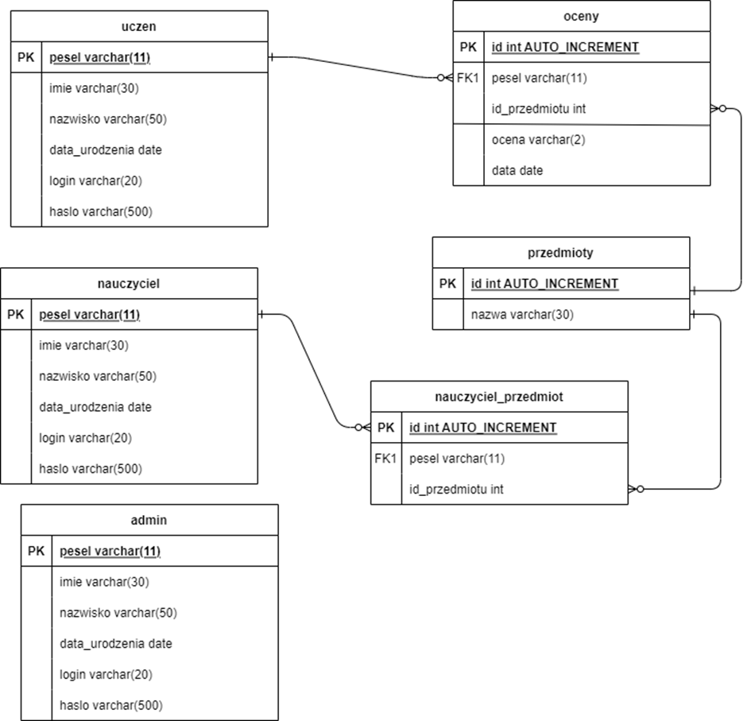

# Electronic gradebook

My application is a simple electronic gradebook written in PHP. It has three types of users: student, teacher, and administrator. A student can only view their grades for specific subjects. A teacher can assign, edit, and delete grades for specific students in the subjects they teach. An administrator can add new users to the database, edit their data, and remove them from the database, as well as add, edit, and delete subjects and assign subjects to teachers.

The database contains six tables that store data on students, teachers, and administrators, subject names, students' grades in individual subjects, and the relationships between teachers and the subjects they teach. The database also includes six triggers, with two for each table containing users' personal data. The first trigger checks, before inserting records into the table, whether the PESEL number is valid and consistent with the date of birth, and whether the new data does not conflict with data from other tables. The second trigger operates similarly to the first one but is executed before updating records. Additionally, the database contains a function that is called within the triggers to verify whether the PESEL number is valid and consistent with the date of birth. Every relationship is in Boyce-Codd normal form. Below, I present the entity-relationship diagram.

# Dziennik elektroniczny

Moja aplikacja jest prostym dziennikiem elektronicznym napisanym w PHP. Występują w niej trzy rodzaje użytkowników: uczeń, nauczyciel i administrator. Uczeń może jedynie przeglądać swoje oceny z konkretnych przedmiotów. Nauczyciel może wystawiać, edytować i usuwać oceny konkretnym uczniom z przedmiotów, których uczy. Administrator może dodawać do bazy danych nowych użytkowników, edytować ich dane oraz usuwać ich z bazy danych, dodawać, edytować i usuwać przedmioty oraz przyporządkowywać nauczycielom przedmioty, których uczą.

W bazie danych znajduje się 6 tabel zawierających dane uczniów, nauczycieli i administratorów, nazwy przedmiotów, oceny uczniów z poszczególnych przedmiotów oraz relacje między nauczycielami a przedmiotami, których uczą. W bazie danych znajduje się również 6 triggerów, po 2 na każdą tabelę zawierającą dane personalne użytkowników. Pierwszym z nich jest trigger, który przed wstawianiem rekordów do tabeli sprawdza, czy pesel jest poprawny i zgodny z datą urodzenia oraz czy nowe dane nie są sprzeczne z danymi z innych tabel. Drugim jest trigger działający na podobnej zasadzie, co pierwszy trigger, tylko jest on uruchamiany przed aktualizowaniem rekordów. Ponadto w bazie danych znajduje się funkcja, która jest wywoływana w triggerach w celu sprawdzenia, czy pesel jest poprawny i zgodny z datą urodzenia. Każda relacja jest w postaci normalnej Boyce’a-Codda. Powyżej przedstawiam diagram związków encji.
